---
## Front matter
title: "Отчет по лабораторной работе №3"
subtitle: "Язык разметки Markdown"
author: "Баранов Никита Дмитриевич"

## Generic otions
lang: ru-RU
toc-title: "Содержание"

## Bibliography
bibliography: bib/cite.bib
csl: pandoc/csl/gost-r-7-0-5-2008-numeric.csl

## Pdf output format
toc: true # Table of contents
toc-depth: 2
lof: true # List of figures
lot: true # List of tables
fontsize: 12pt
linestretch: 1.5
papersize: a4
documentclass: scrreprt
## I18n polyglossia
polyglossia-lang:
  name: russian
  options:
	- spelling=modern
	- babelshorthands=true
polyglossia-otherlangs:
  name: english
## I18n babel
babel-lang: russian
babel-otherlangs: english
## Fonts
mainfont: IBM Plex Serif
romanfont: IBM Plex Serif
sansfont: IBM Plex Sans
monofont: IBM Plex Mono
mathfont: STIX Two Math
mainfontoptions: Ligatures=Common,Ligatures=TeX,Scale=0.94
romanfontoptions: Ligatures=Common,Ligatures=TeX,Scale=0.94
sansfontoptions: Ligatures=Common,Ligatures=TeX,Scale=MatchLowercase,Scale=0.94
monofontoptions: Scale=MatchLowercase,Scale=0.94,FakeStretch=0.9
mathfontoptions:
## Biblatex
biblatex: true
biblio-style: "gost-numeric"
biblatexoptions:
  - parentracker=true
  - backend=biber
  - hyperref=auto
  - language=auto
  - autolang=other*
  - citestyle=gost-numeric
## Pandoc-crossref LaTeX customization
figureTitle: "Рис."
tableTitle: "Таблица"
listingTitle: "Листинг"
lofTitle: "Список иллюстраций"
lotTitle: "Список таблиц"
lolTitle: "Листинги"
## Misc options
indent: true
header-includes:
  - \usepackage{indentfirst}
  - \usepackage{float} # keep figures where there are in the text
  - \floatplacement{figure}{H} # keep figures where there are in the text
---

# Цель работы

Целью работы является освоение процедуры оформления отчетов с помощью легковесного
языка разметки Markdown.

# Задание

Сформировать отчет по лабораторной работе №2 с помощью Markdown.

# Выполнение лабораторной работы №3

Переходим в каталог, который привязан к репозиторию Git на сайте github и обновляем локальный репозиторий, скачав изменения из удаленного репозитория с помощью команды git pull(рис. @fig:001).

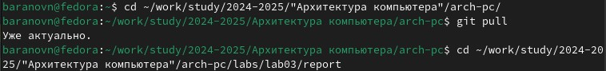{#fig:001 width=70%}

Используем команду make и проверяем появились ли файлы(рис. @fig:002).

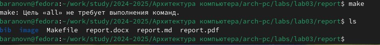{#fig:002 width=70%}

Удаляем полученные файлы с помощью make clean, проверяем удалились ли они и открываем файл report.md в текстовом редакторе gedit(рис. @fig:003).(рис. @fig:004).(рис. @fig:005).

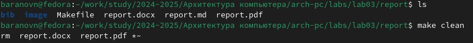{#fig:003 width=70%}

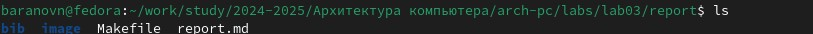{#fig:004 width=70%}

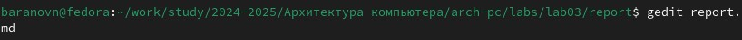{#fig:005 width=70%}

Внимательно изучаем содержимое файла(рис. @fig:006).

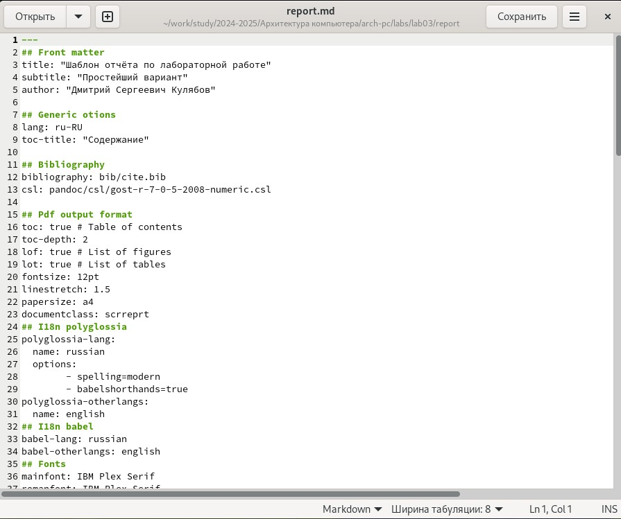{#fig:006 width=70%}

Начинаем изменять файл(рис. @fig:007).

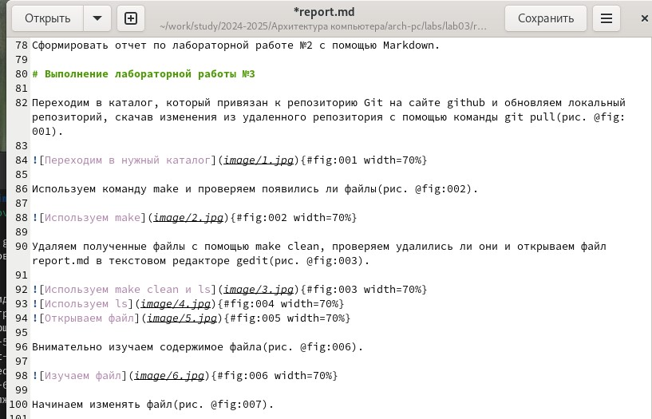{#fig:007 width=70%}

# Делаем отчет лабораторной работы №2

Создаем профиль на гитхабе(рис. @fig:008).

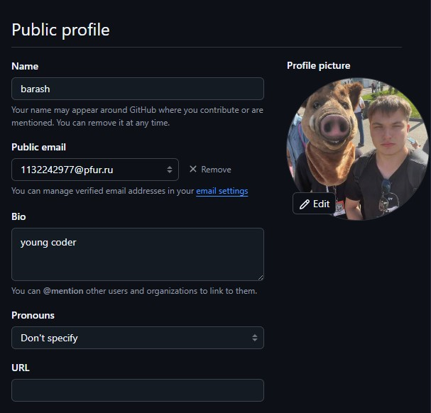{#fig:008 width=70%}

Делаем предварительную конфигурацию git и настраиваем utf-8.Задаем имя начальной ветки.Параметры autocrlf и safecrlf(рис. @fig:009).

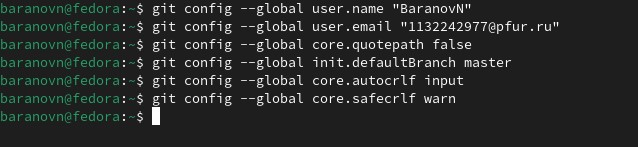{#fig:009 width=70%}

Для последующей идентификации пользователя на сервере репозиториев необходимо
сгенерировать пару ключей (приватный и открытый). Ключи сохраняться в каталоге ~/.ssh/. Далее необходимо загрузить сгенерённый открытый ключ.(рис. @fig:010). (рис. @fig:011).(рис. @fig:012).

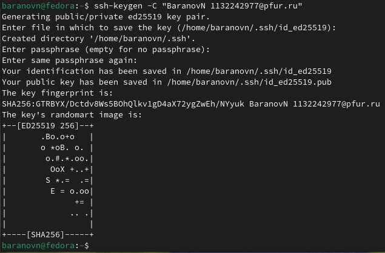{#fig:010 width=70%}

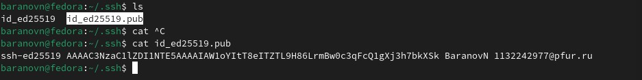{#fig:011 width=70%}

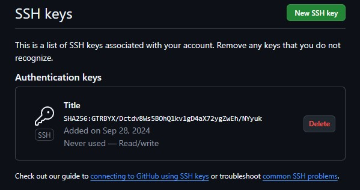{#fig:012 width=70%}

Откройте терминал и создайте каталог для предмета «Архитектура компьютера»(рис. @fig:013).

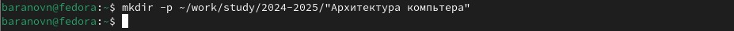{#fig:013 width=70%}

Перейдите на станицу репозитория с шаблоном курса https://github.com/yamadharma/course-directory-student-template. Далее выберите Use this template. В открывшемся окне задайте имя репозитория (Repository name) study_2024–2025_arhpc и создайте репозиторий (кнопка Create repository from template)(рис. @fig:014).

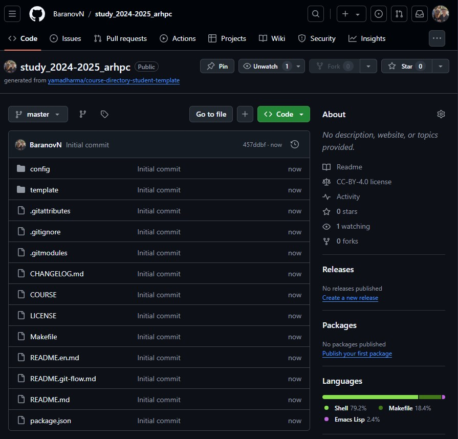{#fig:014 width=70%}

Откройте терминал и перейдите в каталог курса.Клонируйте созданный репозиторий(рис. @fig:015).

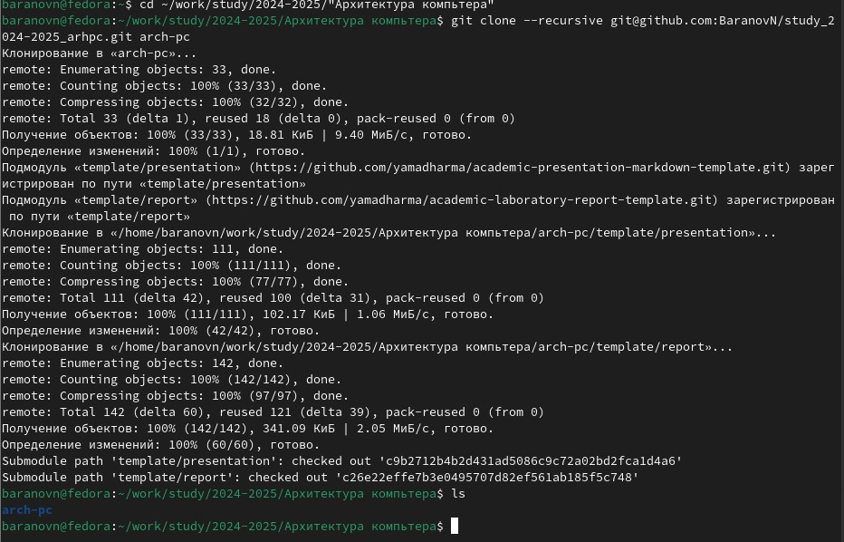{#fig:015 width=70%}

Перейдите в каталог курса.Удалите лишние файлы. Создайте необходимые каталоги.Отправьте файлы на сервер. Проверьте правильность создания иерархии рабочего пространства в локальном репозитории и на странице github(рис. @fig:016).(рис. @fig:017).(рис. @fig:018).(рис. @fig:019).(рис. @fig:020).(рис. @fig:021).

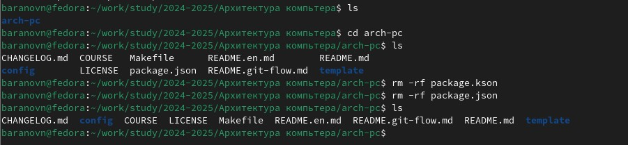{#fig:016 width=70%}

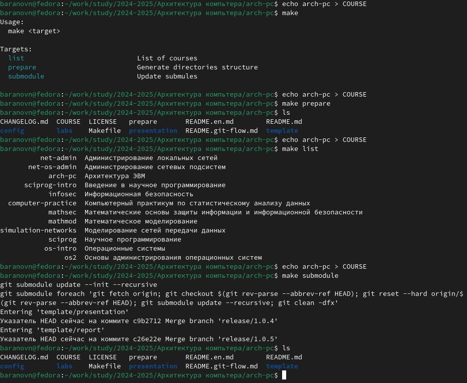{#fig:017 width=70%}

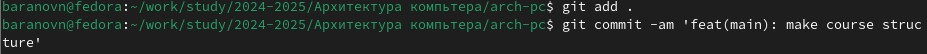{#fig:018 width=70%}

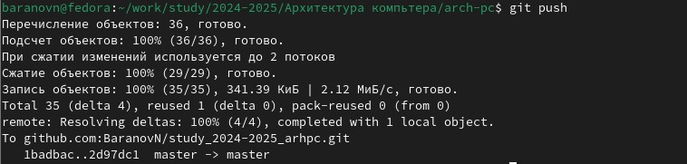{#fig:019 width=70%}

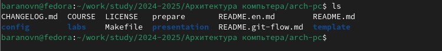{#fig:020 width=70%}

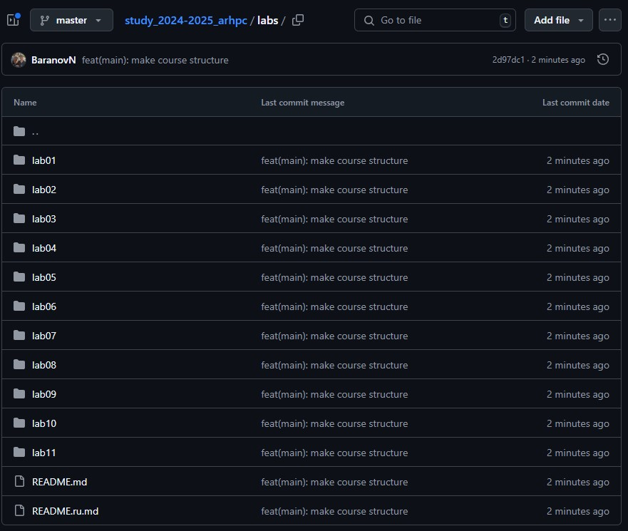{#fig:021 width=70%}

Самостоятельная работа (рис. @fig:022).(рис. @fig:023).(рис. @fig:024).

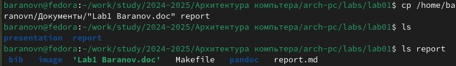{#fig:022 width=70%}

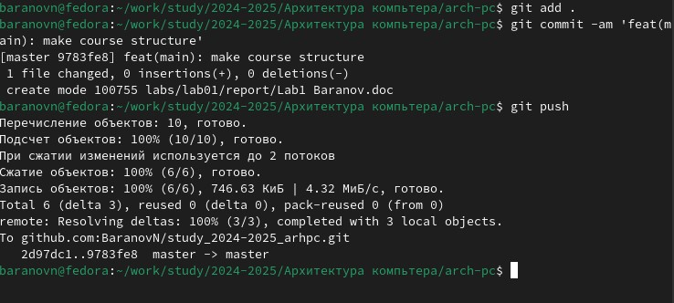{#fig:023 width=70%}

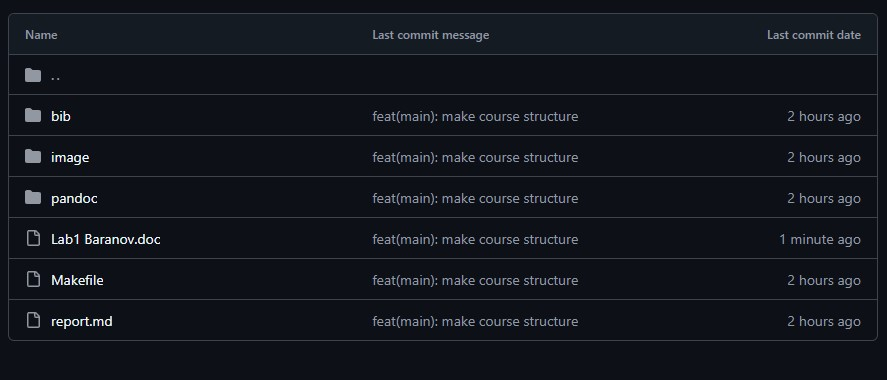{#fig:024 width=70%}

# Выводы

Мы познакомились с языком разметки Markdown и оформили отчет в ней и загрузили на Github.

