---
## Front matter
title: "Лабораторная работа №6"
subtitle: "Арифметические операции в NASM"
author: "Баранов Никита Дмитриевич"

## Generic otions
lang: ru-RU
toc-title: "Содержание"

## Bibliography
bibliography: bib/cite.bib
csl: pandoc/csl/gost-r-7-0-5-2008-numeric.csl

## Pdf output format
toc: true # Table of contents
toc-depth: 2
lof: true # List of figures
lot: true # List of tables
fontsize: 12pt
linestretch: 1.5
papersize: a4
documentclass: scrreprt
## I18n polyglossia
polyglossia-lang:
  name: russian
  options:
	- spelling=modern
	- babelshorthands=true
polyglossia-otherlangs:
  name: english
## I18n babel
babel-lang: russian
babel-otherlangs: english
## Fonts
mainfont: IBM Plex Serif
romanfont: IBM Plex Serif
sansfont: IBM Plex Sans
monofont: IBM Plex Mono
mathfont: STIX Two Math
mainfontoptions: Ligatures=Common,Ligatures=TeX,Scale=0.94
romanfontoptions: Ligatures=Common,Ligatures=TeX,Scale=0.94
sansfontoptions: Ligatures=Common,Ligatures=TeX,Scale=MatchLowercase,Scale=0.94
monofontoptions: Scale=MatchLowercase,Scale=0.94,FakeStretch=0.9
mathfontoptions:
## Biblatex
biblatex: true
biblio-style: "gost-numeric"
biblatexoptions:
  - parentracker=true
  - backend=biber
  - hyperref=auto
  - language=auto
  - autolang=other*
  - citestyle=gost-numeric
## Pandoc-crossref LaTeX customization
figureTitle: "Рис."
tableTitle: "Таблица"
listingTitle: "Листинг"
lofTitle: "Список иллюстраций"
lotTitle: "Список таблиц"
lolTitle: "Листинги"
## Misc options
indent: true
header-includes:
  - \usepackage{indentfirst}
  - \usepackage{float} # keep figures where there are in the text
  - \floatplacement{figure}{H} # keep figures where there are in the text
---

# Цель работы

Освоение арифметических инструкций языка ассемблера NASM.

# Задание

Написать программы для решения выражений.

# Выполнение лабораторной работы

Создайте каталог для программам лабораторной работы № 6, перейдите в него и создайте файл lab6-1.asm . Введите в файл lab6-1.asm текст программы из листинга 6.1. Далее выводим результат. Создайте исполняемый файл и запустите его. Далее изменим текст программы и вместо символов, запишем в регистры числа(рис. @fig:001)(рис. @fig:002)(рис. @fig:003)(рис. @fig:004)

{#fig:001 width=70%}

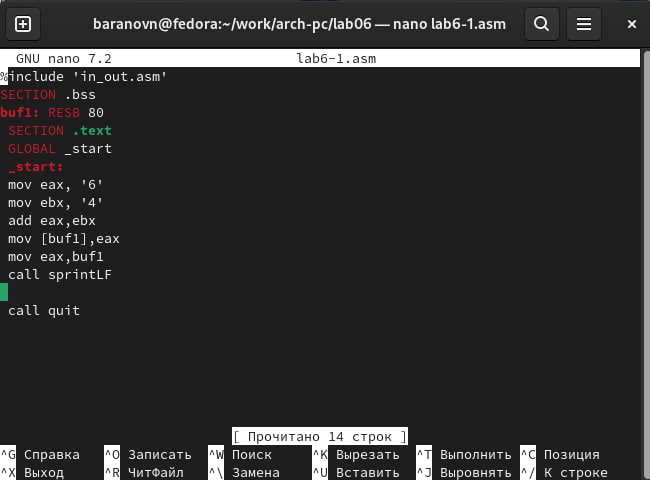{#fig:002 width=70%}

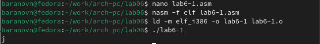{#fig:003 width=70%}

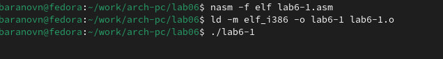{#fig:004 width=70%}

Создайте файл lab6-2.asm в каталоге ~/work/arch-pc/lab06 и введите в него текст программы из листинга 6.2.Создайте исполняемый файл и запустите его.Аналогично предыдущему примеру изменим символы на числа.Создайте исполняемый файл и запустите его. Какой результат будет получен при исполнении программы?Замените функцию iprintLF на iprint. Создайте исполняемый файл и запустите его. Чем отличается вывод функций iprintLF и iprint?(рис. @fig:005)(рис. @fig:006)(рис. @fig:007)(рис. @fig:008)(рис. @fig:009)(рис. @fig:010)

{#fig:005 width=70%}

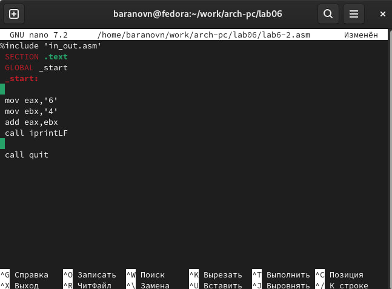{#fig:006 width=70%}

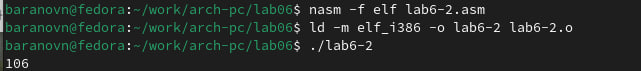{#fig:007 width=70%}

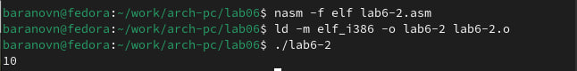{#fig:008 width=70%}

В результате программы мы наконец получили сумму 6 и 4 - 10.

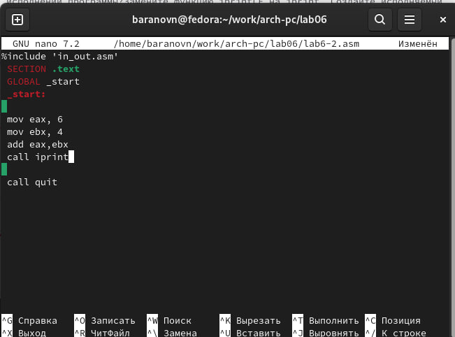{#fig:009 width=70%}

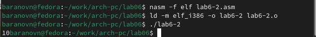{#fig:010 width=70%}

Вывод функций различается тем, что iprintLF в отличие от iprint не переносит на другую строку после вывода.

В качестве примера выполнения арифметических операций в NASM приведем программу вычисления арифметического выражения 𝑓(𝑥) = (5 ∗ 2 + 3)/3.Создайте файл lab6-3.asm в каталоге ~/work/arch-pc/lab06.Внимательно изучите текст программы из листинга 6.3 и введите в lab6-3.asm.Создайте исполняемый файл и запустите его.Измените текст программы для вычисления выражения 𝑓(𝑥) = (4 ∗ 6 + 2)/5. Создайте исполняемый файл и проверьте его работу(рис. @fig:011)(рис. @fig:012)(рис. @fig:013)(рис. @fig:014)

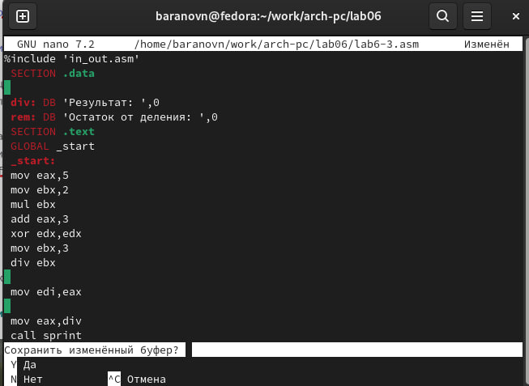{#fig:011 width=70%}

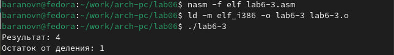{#fig:012 width=70%}

Наш результат совпал с тем, что должен был получиться.

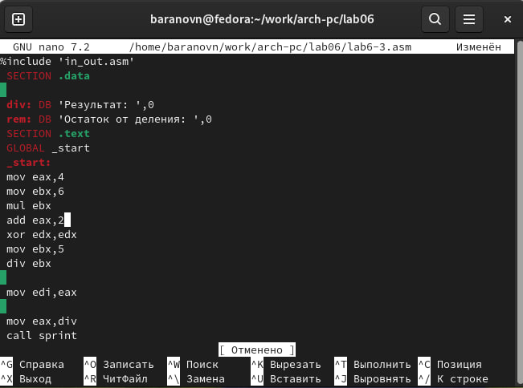{#fig:013 width=70%}

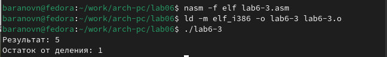{#fig:014 width=70%}

Создайте файл variant.asm в каталоге ~/work/arch-pc/lab06. Внимательно изучите текст программы из листинга 6.4 и введите в файл variant.asm. Создайте исполняемый файл и запустите его. Проверьте результат работы программы вычислив номер варианта аналитически.(рис. @fig:015)(рис. @fig:016)

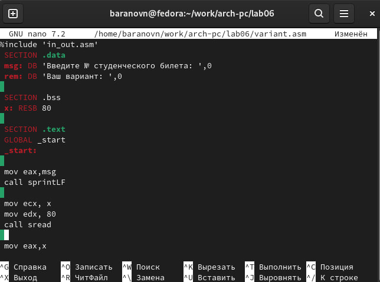{#fig:015 width=70%}

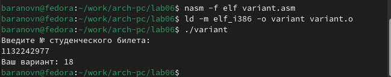{#fig:016 width=70%}

# Ответы на вопросы

1. Строки "mov eax,rem", "call sprint" отвечают за вывод сообщения "Ваш вариант" на экран

2. Эти инструкции позволяют программе считать строчки которые пользователь вводит на экран

3. Инструкция "call atoi" преобразует строку в целое число

4. Строка “xor edx,edx” обнуляет регистр edx перед выполнением деления. Строка “mov ebx,20” загружает значение 20 в регистр ebx. Строка “div ebx” выполняет деление регистра eax на значение регистра ebx с сохранением частного в регистре eax и остатка в
регистре edx.

5. Остаток от деления записывает в регистр edx

6. Функция используется для увелечение значения регистра edx на 1 

7. Строки "mov eax, edx", "call iprintLF". Первая передает значение остатка от деления в регистр eax. Вторая выводит значения на экран.

# Самостоятельная работа

Написать программу вычисления выражения 𝑦 = 𝑓(𝑥). Программа должна выводить выражение для вычисления, выводить запрос на ввод значения 𝑥, вычислять заданное выражение в зависимости от введенного 𝑥, выводить результат вычислений. Вид функции 𝑓(𝑥) выбрать из таблицы 6.3 вариантов заданий в соответствии с номером полученным при выполнении лабораторной работы. Создайте исполняемый файл и проверьте его работу для значений 𝑥1 и 𝑥2 из 6.3(рис. @fig:017)(рис. @fig:018)

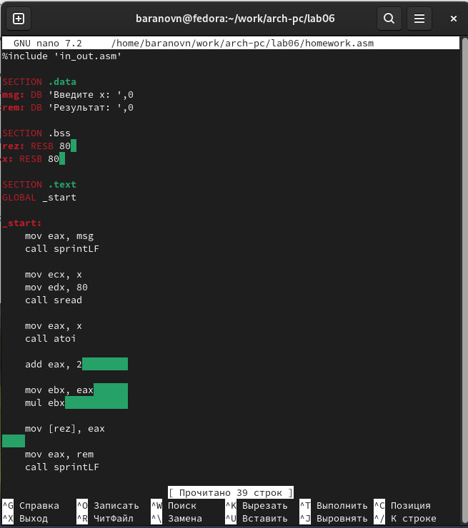{#fig:017 width=70%}

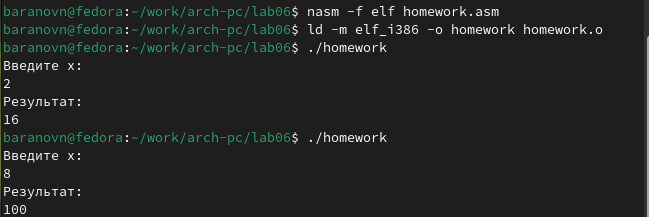{#fig:018 width=70%}

# Выводы

Мы приобрели навыки создания исполнительных файлов для решения выражений и освоили арифметические инструкции в NASM.

