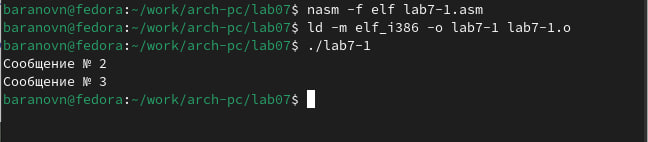

---
## Front matter
title: "Лабораторная работа №7"
subtitle: "Команды безусловного и условного переходов в Nasm. Программирование ветвлений."
author: "Баранов Никита Дмитриевич"

## Generic otions
lang: ru-RU
toc-title: "Содержание"

## Bibliography
bibliography: bib/cite.bib
csl: pandoc/csl/gost-r-7-0-5-2008-numeric.csl

## Pdf output format
toc: true # Table of contents
toc-depth: 2
lof: true # List of figures
lot: true # List of tables
fontsize: 12pt
linestretch: 1.5
papersize: a4
documentclass: scrreprt
## I18n polyglossia
polyglossia-lang:
  name: russian
  options:
	- spelling=modern
	- babelshorthands=true
polyglossia-otherlangs:
  name: english
## I18n babel
babel-lang: russian
babel-otherlangs: english
## Fonts
mainfont: IBM Plex Serif
romanfont: IBM Plex Serif
sansfont: IBM Plex Sans
monofont: IBM Plex Mono
mathfont: STIX Two Math
mainfontoptions: Ligatures=Common,Ligatures=TeX,Scale=0.94
romanfontoptions: Ligatures=Common,Ligatures=TeX,Scale=0.94
sansfontoptions: Ligatures=Common,Ligatures=TeX,Scale=MatchLowercase,Scale=0.94
monofontoptions: Scale=MatchLowercase,Scale=0.94,FakeStretch=0.9
mathfontoptions:
## Biblatex
biblatex: true
biblio-style: "gost-numeric"
biblatexoptions:
  - parentracker=true
  - backend=biber
  - hyperref=auto
  - language=auto
  - autolang=other*
  - citestyle=gost-numeric
## Pandoc-crossref LaTeX customization
figureTitle: "Рис."
tableTitle: "Таблица"
listingTitle: "Листинг"
lofTitle: "Список иллюстраций"
lotTitle: "Список таблиц"
lolTitle: "Листинги"
## Misc options
indent: true
header-includes:
  - \usepackage{indentfirst}
  - \usepackage{float} # keep figures where there are in the text
  - \floatplacement{figure}{H} # keep figures where there are in the text
---

# Цель работы

Изучение команд условного и безусловного переходов. Приобретение навыков написания
программ с использованием переходов. Знакомство с назначением и структурой файла
листинга.

# Задание

Написать программы для решения системы выражений.

# Выполнение лабораторной работы

Создайте каталог для программам лабораторной работы № 7, перейдите в него и создайте файл lab7-1.asm. Инструкция jmp в NASM используется для реализации безусловных переходов. Рассмотрим пример программы с использованием инструкции jmp. Введите в файл lab7-1.asm текст программы из листинга 7.1.Создайте исполняемый файл и запустите его(рис. @fig:001)(рис. @fig:002)(рис. @fig:003).

{#fig:001 width=70%}

{#fig:002 width=70%}

{#fig:003 width=70%}

Наш вывод совпал с выводом в инструкции.Изменим программу таким образом, чтобы она выводила сначала ‘Сообщение № 2’, потом ‘Сообщение № 1’ и завершала работу.Создайте исполняемый файл и проверьте его работу. Измените текст программы добавив или изменив инструкции jmp, чтобы вывод программы был Сообщение № 3 Сообщение № 2 Сообщение № 1.(рис. @fig:004)(рис. @fig:005)(рис. @fig:006)(рис. @fig:007)

{#fig:004 width=70%}

{#fig:005 width=70%}

{#fig:006 width=70%}

{#fig:007 width=70%}

Создайте файл lab7-2.asm в каталоге ~/work/arch-pc/lab07. Внимательно изучите текст программы из листинга 7.3 и введите в lab7-2.asm(рис. @fig:008)(рис. @fig:009)(рис. @fig:010)

{#fig:008 width=70%}

{#fig:009 width=70%}

{#fig:010 width=70%}

Создайте файл листинга для программы из файла lab7-2.asm. Откройте файл листинга lab7-2.lst с помощью любого текстового редактора.Внимательно ознакомиться с его форматом и содержимым. Подробно объяснить содержимое трёх строк файла листинга по выбору. Откройте файл с программой lab7-2.asm и в любой инструкции с двумя операндами удалить один операнд. Выполните трансляцию с получением файла листинга.Какие выходные файлы создаются в этом случае? Что добавляется в листинге?(рис. @fig:011)(рис. @fig:012)

{#fig:011 width=70%}

{#fig:012 width=70%}

Строка 5 - 00000001 89C3 mov     ebx, eax
00000001 - адрес в сегменте кода
89C3 - машинный код для инструкции
mov ebx,eax - присваивание переменной ebx значения, хранящееся в регистре eax
Строка 26 - 00000012 50 push    eax
00000012 - адрес в сегменте кода
50 - машинный код для инструкции
push eax - значение из регистра eax помещается в стек
Строка 53 - 0000003B E8CFFFFFFF call    sprint
0000003B - адрес в сегменте кода
E8CFFFFFFF - машинный код для инструкции
call sprint - вызов функции sprint, которая выводит данные на экран

# Самостоятельная работа

Напишите программу нахождения наименьшей из 3 целочисленных переменных a, b, c.
Значения переменных выбрать из табл. 7.5 в соответствии с вариантом, полученным
при выполнении лабораторной работы № 7. Создайте исполняемый файл и проверьте
его работу(рис. @fig:013)(рис. @fig:014)

{#fig:013 width=70%}

{#fig:014 width=70%}

Напишите программу, которая для введенных с клавиатуры значений x и a вычисляет
значение заданной функции f(x) и выводит результат вычислений. Вид функции f(x)
выбрать из таблицы 7.6 вариантов заданий в соответствии с вариантом, полученным
при выполнении лабораторной работы № 7. Создайте исполняемый файл и проверьте
его работу для значений x и a из 7.6.(рис. @fig:015)(рис. @fig:016)

{#fig:015 width=70%}

{#fig:016 width=70%}

# Выводы

Мы познакомились с структурой файла листинга, изучили команды условного и безусловного перехода.
