---
## Front matter
title: "Лабораторная работа №8"
subtitle: "Программирование цикла. Обработка аргументов командной строки."
author: "Баранов Никита Дмитриевич"

## Generic otions
lang: ru-RU
toc-title: "Содержание"

## Bibliography
bibliography: bib/cite.bib
csl: pandoc/csl/gost-r-7-0-5-2008-numeric.csl

## Pdf output format
toc: true # Table of contents
toc-depth: 2
lof: true # List of figures
lot: true # List of tables
fontsize: 12pt
linestretch: 1.5
papersize: a4
documentclass: scrreprt
## I18n polyglossia
polyglossia-lang:
  name: russian
  options:
	- spelling=modern
	- babelshorthands=true
polyglossia-otherlangs:
  name: english
## I18n babel
babel-lang: russian
babel-otherlangs: english
## Fonts
mainfont: IBM Plex Serif
romanfont: IBM Plex Serif
sansfont: IBM Plex Sans
monofont: IBM Plex Mono
mathfont: STIX Two Math
mainfontoptions: Ligatures=Common,Ligatures=TeX,Scale=0.94
romanfontoptions: Ligatures=Common,Ligatures=TeX,Scale=0.94
sansfontoptions: Ligatures=Common,Ligatures=TeX,Scale=MatchLowercase,Scale=0.94
monofontoptions: Scale=MatchLowercase,Scale=0.94,FakeStretch=0.9
mathfontoptions:
## Biblatex
biblatex: true
biblio-style: "gost-numeric"
biblatexoptions:
  - parentracker=true
  - backend=biber
  - hyperref=auto
  - language=auto
  - autolang=other*
  - citestyle=gost-numeric
## Pandoc-crossref LaTeX customization
figureTitle: "Рис."
tableTitle: "Таблица"
listingTitle: "Листинг"
lofTitle: "Список иллюстраций"
lotTitle: "Список таблиц"
lolTitle: "Листинги"
## Misc options
indent: true
header-includes:
  - \usepackage{indentfirst}
  - \usepackage{float} # keep figures where there are in the text
  - \floatplacement{figure}{H} # keep figures where there are in the text
---

# Цель работы

Приобретение навыков написания программ с использованием циклов и обработкой
аргументов командной строки

# Задание

Написать программы с использованием циклов и обработкой аргументов командной строки.

# Выполнение лабораторной работы

Создайте каталог для программам лабораторной работы № 8, перейдите в него и создайте
файл lab8-1.asm Введите в файл lab8-1.asm текст программы из листинга 8.1. Создайте исполняемый файл и проверьте его работу.Измените текст программы добавив изменение значение регистра ecx в цикле. Создайте исполняемый файл и проверьте его работу. Какие значения принимает регистр ecx в цикле? Соответствует ли число проходов цикла значению N введенному с клавиатуры?(рис. @fig:001)(рис. @fig:002)(рис. @fig:003)(рис. @fig:004)(рис. @fig:005).

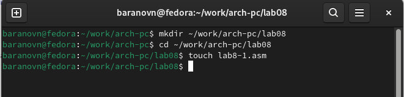{#fig:001 width=70%}

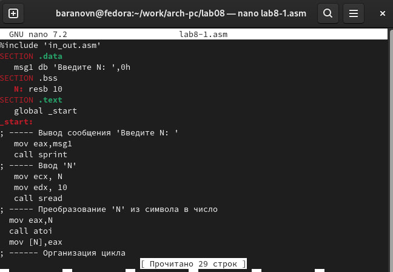{#fig:002 width=70%}

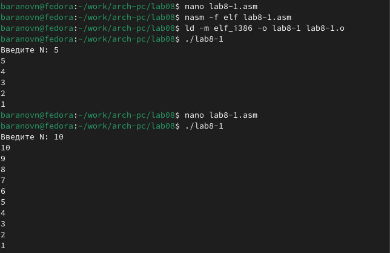{#fig:003 width=70%}

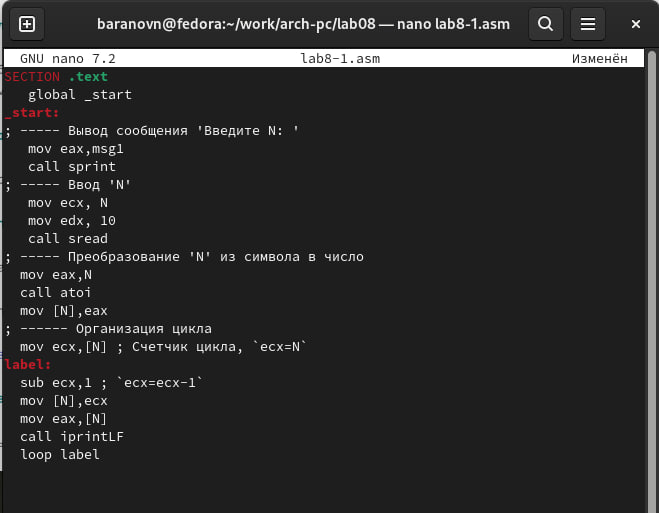{#fig:004 width=70%}

{#fig:005 width=70%}

Регистру ecx присваиваются значения 9 7 5 3 1 - регистр уменьшается на 2. Число проходов не соответствует числу N, из-за уменьшения на 2.

Внесите изменения в текст программы добавив команды push и pop (добавления в стек и извлечения из стека) для сохранения значения счетчика цикла loop. Создайте исполняемый файл и проверьте его работу. Соответствует ли в данном случае число проходов цикла значению N введенному с клавиатуры?(рис. @fig:006)(рис. @fig:007)

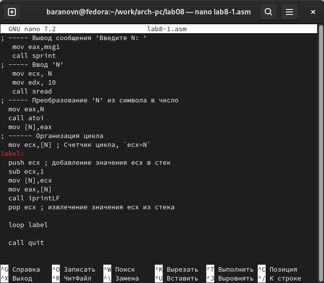{#fig:006 width=70%}

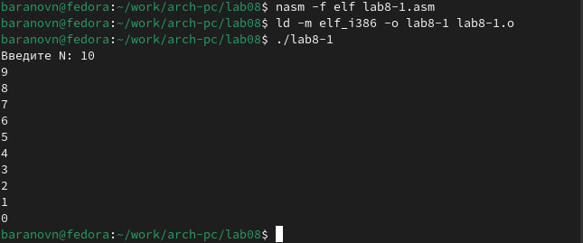{#fig:007 width=70%}

В измененной программе число проходов соответствует числу N.

Создайте файл lab8-2.asm в каталоге ~/work/arch-pc/lab08 и введите в него текст программы из листинга 8.2. Создайте исполняемый файл и запустите его, указав аргументы.Сколько аргументов было обработано программой?(рис. @fig:008)(рис. @fig:009)

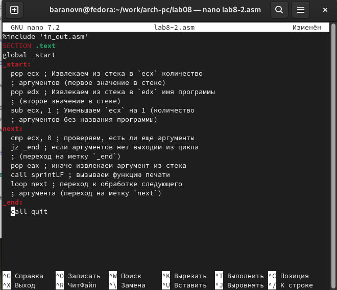{#fig:008 width=70%}

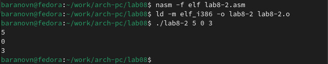{#fig:009 width=70%}

Программа обрабатывает 3 аргумента 

Создайте файл lab8-3.asm в каталоге ~/work/archpc/lab08 и введите в него текст программы из листинга 8.3.Создайте исполняемый файл и запустите его, указав аргументы.Измените текст программы из листинга 8.3 для вычисления произведения аргументов
командной строки.(рис. @fig:010)(рис. @fig:011)(рис. @fig:012)(рис. @fig:013)

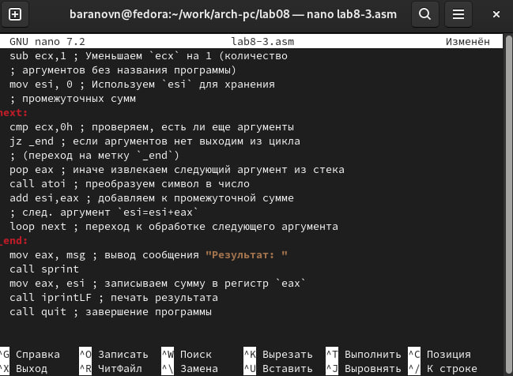{#fig:010 width=70%}

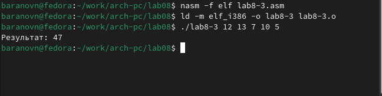{#fig:011 width=70%}

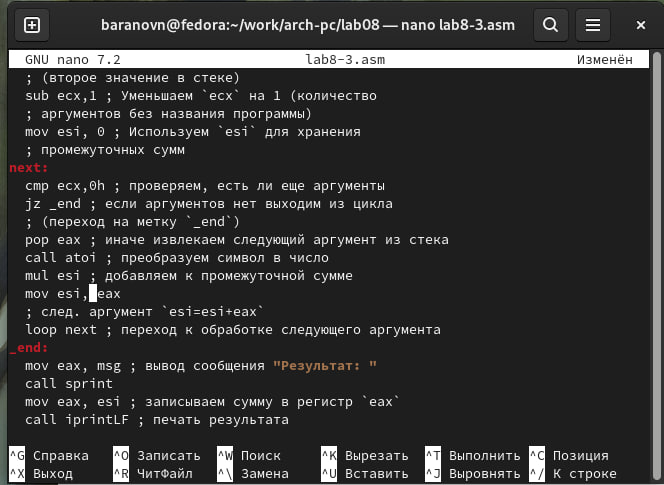{#fig:012 width=70%}

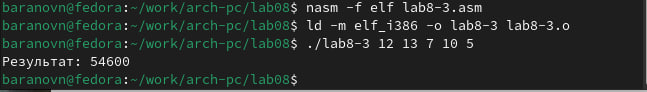{#fig:013 width=70%}

# Самостоятельная работа

Напишите программу, которая находит сумму значений функции 𝑓(𝑥) для x=x1, x2...x т.е. программа должна выводить значение f(x1)+f(x2)+....f(xn) Значения xi передаются как аргументы. Вид функции f(x) выбрать из таблицы 8.1 вариантов заданий в соответствии с вариантом, полученным при выполнении лабораторной работы № 7. Создайте исполняемый файл и проверьте его работу на нескольких наборах x=x1,x2,xn (рис. @fig:014)(рис. @fig:015)

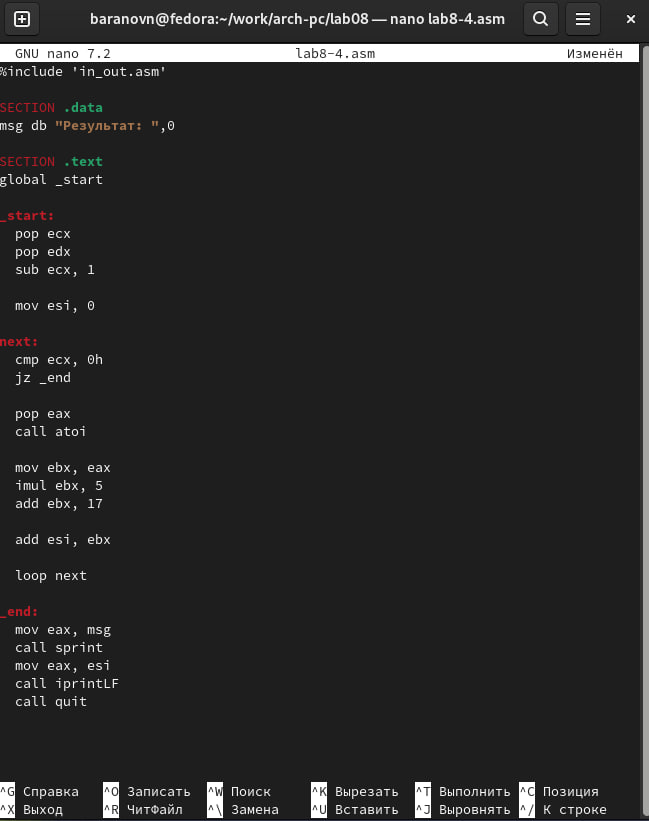{#fig:014 width=70%}

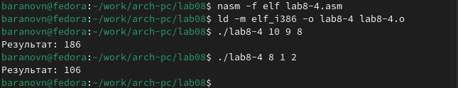{#fig:015 width=70%}

Аналитическим методом я получил соответствующие ответы.

# Выводы

Мы научились решать программы с использованием циклов и обработкой аргументов командной строки.
