---
## Front matter
title: "Лабораторная работа №9"
subtitle: "Понятие подпрограммы.Отладчик GDB"
author: "Баранов Никита Дмитриевич"

## Generic otions
lang: ru-RU
toc-title: "Содержание"

## Bibliography
bibliography: bib/cite.bib
csl: pandoc/csl/gost-r-7-0-5-2008-numeric.csl

## Pdf output format
toc: true # Table of contents
toc-depth: 2
lof: true # List of figures
lot: true # List of tables
fontsize: 12pt
linestretch: 1.5
papersize: a4
documentclass: scrreprt
## I18n polyglossia
polyglossia-lang:
  name: russian
  options:
	- spelling=modern
	- babelshorthands=true
polyglossia-otherlangs:
  name: english
## I18n babel
babel-lang: russian
babel-otherlangs: english
## Fonts
mainfont: IBM Plex Serif
romanfont: IBM Plex Serif
sansfont: IBM Plex Sans
monofont: IBM Plex Mono
mathfont: STIX Two Math
mainfontoptions: Ligatures=Common,Ligatures=TeX,Scale=0.94
romanfontoptions: Ligatures=Common,Ligatures=TeX,Scale=0.94
sansfontoptions: Ligatures=Common,Ligatures=TeX,Scale=MatchLowercase,Scale=0.94
monofontoptions: Scale=MatchLowercase,Scale=0.94,FakeStretch=0.9
mathfontoptions:
## Biblatex
biblatex: true
biblio-style: "gost-numeric"
biblatexoptions:
  - parentracker=true
  - backend=biber
  - hyperref=auto
  - language=auto
  - autolang=other*
  - citestyle=gost-numeric
## Pandoc-crossref LaTeX customization
figureTitle: "Рис."
tableTitle: "Таблица"
listingTitle: "Листинг"
lofTitle: "Список иллюстраций"
lotTitle: "Список таблиц"
lolTitle: "Листинги"
## Misc options
indent: true
header-includes:
  - \usepackage{indentfirst}
  - \usepackage{float} # keep figures where there are in the text
  - \floatplacement{figure}{H} # keep figures where there are in the text
---

# Цель работы

Приобретение навыков написания программ с использованием подпрограмм. Знакомство
с методами отладки при помощи GDB и его основными возможностями.

# Выполнение лабораторной работы

Создайте каталог для выполнения лабораторной работы № 9, перейдите в него и создайте файл lab09-1.asm. В качестве примера рассмотрим программу вычисления арифметического выражения f(x) = 2x + 7 с помощью подпрограммы _calcul. В данном примере x вводится с клавиатуры, а само выражение вычисляется в подпрограмме. Внимательно изучите текст программы.Введите в файл lab09-1.asm текст программы из листинга 9.1. Создайте исполняемый файл и проверьте его работу.Измените текст программы, добавив подпрограмму _subcalcul в подпрограмму _calcul,
для вычисления выражения f(g(x)), где x вводится с клавиатуры, f(x) = 2x + 7, g(x) = 3x − 1. Т.е. x передается в подпрограмму _calcul из нее в подпрограмму _subcalcul, где вычисляется выражение g(x), результат возвращается в _calcul и вычисляется выражение f(g(x)). Результат возвращается в основную программу для вывода результата на экран.(рис. @fig:001)(рис. @fig:002)(рис. @fig:003)(рис. @fig:004)(рис. @fig:005).

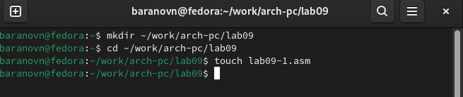{#fig:001 width=70%}

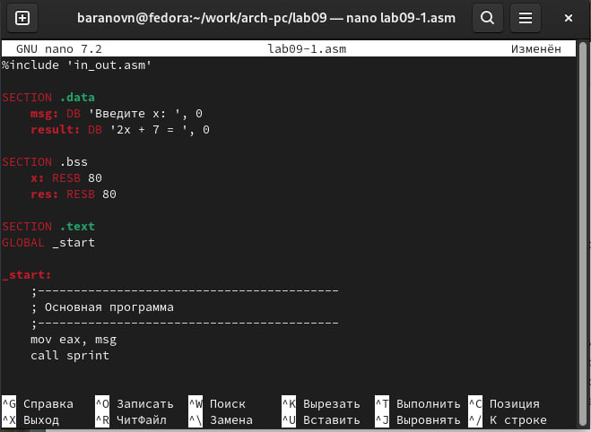{#fig:002 width=70%}

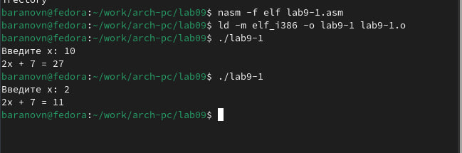{#fig:003 width=70%}

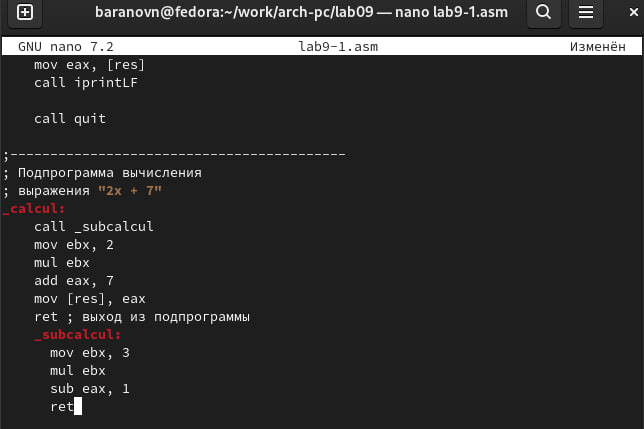{#fig:004 width=70%}

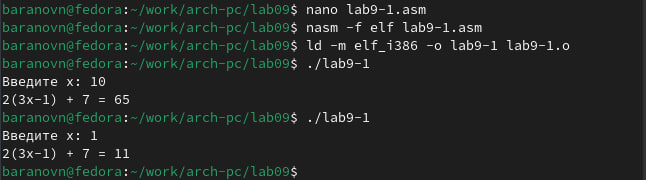{#fig:005 width=70%}

Создайте файл lab09-2.asm с текстом программы из Листинга 9.2. (Программа печати
сообщения Hello world!Получите исполняемый файл.Для работы с GDB в исполняемый файл необходимо добавить отладочную информацию, для этого трансляцию программ необходимо проводить с ключом ‘-g’.Загрузите исполняемый файл в отладчик gdb.Проверьте работу программы, запустив ее в оболочке GDB с помощью команды run (сокращённо r). Для более подробного анализа программы установите брейкпоинт на метку _start, с которой начинается выполнение любой ассемблерной программы, и запустите её. Посмотрите дисассимилированный код программы с помощью команды disassemble начиная с метки _start. Переключитесь на отображение команд с Intel’овским синтаксисом, введя команду set disassembly-flavor intel.Перечислите различия отображения синтаксиса машинных команд в режимах ATT и Intel.
Включите режим псевдографики для более удобного анализа программы(рис. @fig:006)(рис. @fig:007)(рис. @fig:008)(рис. @fig:009)(рис. @fig:010)(рис. @fig:011)(рис. @fig:012)

{#fig:006 width=70%}

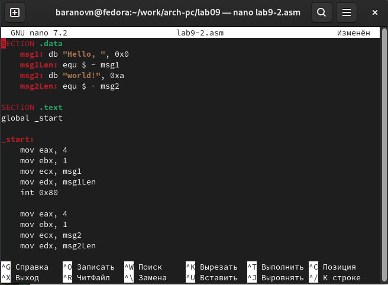{#fig:007 width=70%}

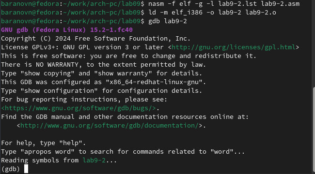{#fig:008 width=70%}

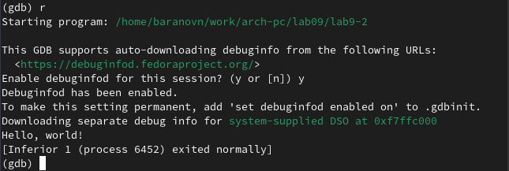{#fig:009 width=70%}

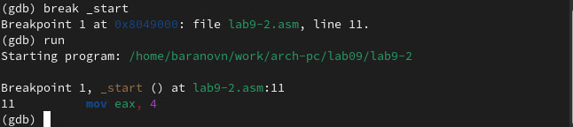{#fig:010 width=70%}

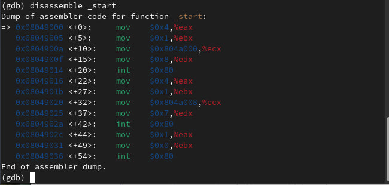{#fig:011 width=70%}

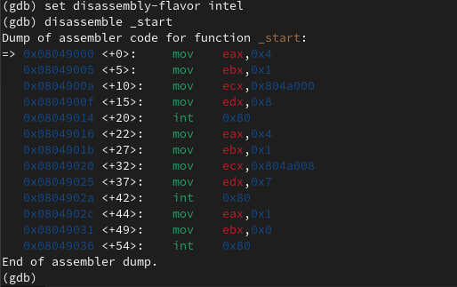{#fig:012 width=70%}

Различия в отображении синтаксиса:
Порядок операндов: Intel: Операнды записываются в порядке destination, source. ATT: Операнды записываются в порядке source, destination. 
Суффиксы: Intel: Суффиксы для указания размера данных не используются. ATT: Используются суффиксы для указания размера данных.
Регистры: Intel: Регистры указываются без каких-либо префиксов.ATT: Регистры указываются с префиксом.
Константы:Intel: Константы записываются без специальных символов.ATT: Константы обозначаются с помощью $.

Включаем режим псевдографики.На предыдущих шагах была установлена точка останова по имени метки (_start). Проверьте это с помощью команды info breakpoints(кратко i b).Установим еще одну точку останова по адресу инструкции. Адрес инструкции можно увидеть в средней части экрана в левом столбце соответствующей инструкции (см. рис. 9.3).Определите адрес предпоследней инструкции (mov ebx,0x0) и установите точку останова.Посмотрите информацию о всех установленных точках останова(рис. @fig:013)(рис. @fig:014)

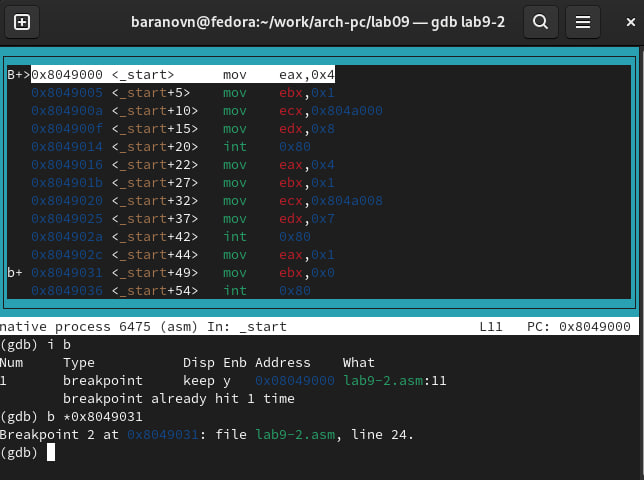{#fig:013 width=70%}

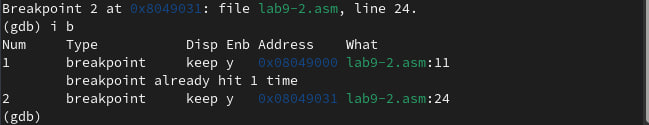{#fig:014 width=70%}

Выполните 5 инструкций с помощью команды stepi (или si) и проследите за изменением
значений регистров. Значения каких регистров изменяются? Посмотреть содержимое регистров также можно с помощью команды info registers (или i r).Посмотрите значение переменной msg1 по имени.Посмотрите значение переменной msg2 по адресу. Адрес переменной можно определить по дизассемблированной инструкции. Посмотрите инструкцию mov ecx,msg2 которая записывает в регистр ecx адрес перемененной msg2. Измените первый символ переменной msg1.Замените любой символ во второй переменной msg2.Выведете в различных форматах (в шестнадцатеричном формате, в двоичном формате и в символьном виде) значение регистра edx.С помощью команды set измените значение регистра ebx.Объясните разницу вывода команд p/s $ebx. Завершите выполнение программы с помощью команды continue (сокращенно c) или stepi (сокращенно si) и выйдите из GDB с помощью команды quit (сокращенно q)(рис. @fig:015)(рис. @fig:016)(рис. @fig:017)(рис. @fig:018)(рис. @fig:019)(рис. @fig:020)(рис. @fig:021)(рис. @fig:022)

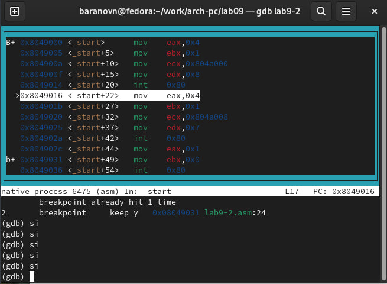{#fig:015 width=70%}

Изменяются значения регистров - eax,ebx,ecx,edx,eip

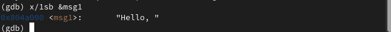{#fig:016 width=70%}

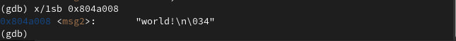{#fig:017 width=70%}

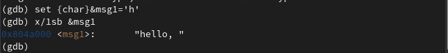{#fig:018 width=70%}

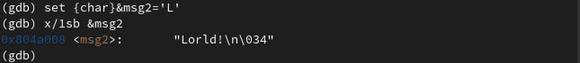{#fig:019 width=70%}

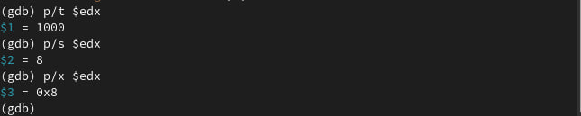{#fig:020 width=70%}

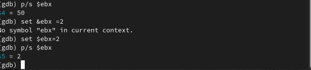{#fig:021 width=70%}

Выводятся разные значения т.к. команда без кавычек присваивает регистру вводимое значение.

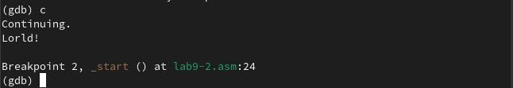{#fig:022 width=70%}

Скопируйте файл lab8-2.asm, созданный при выполнении лабораторной работы №8,
с программой выводящей на экран аргументы командной строки (Листинг 8.2) в файл с
именем lab09-3.asm.Создайте исполняемый файл.Для загрузки в gdb программы с аргументами необходимо использовать ключ --args. Загрузите исполняемый файл в отладчик, указав аргументы.Для начала установим точку останова перед первой инструкцией в программе и запустим ее.Адрес вершины стека храниться в регистре esp и по этому адресу располагается число равное количеству аргументов командной строки (включая имя программы).Посмотрите остальные позиции стека – по адесу esp+4 располагается адрес в памяти где находиться имя программы, по адесу esp+8 храниться адрес первого аргумента, по аресу esp+12 – второго и т.д.Объясните, почему шаг изменения адреса равен 4 (esp+4, esp+8, esp+12 и т.д.)(рис. @fig:023)(рис. @fig:024)(рис. @fig:025)

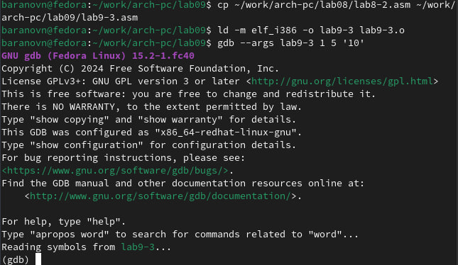{#fig:023 width=70%}

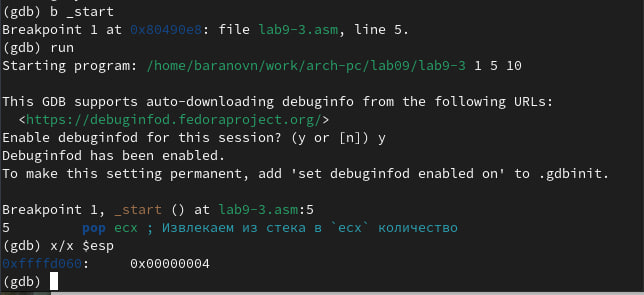{#fig:024 width=70%}

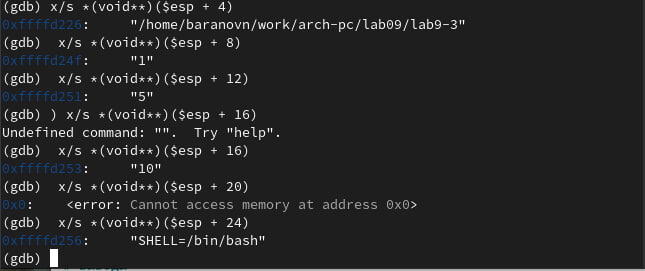{#fig:025 width=70%}

Шаг изменения равен 4 потому что регистры имеют размерность в 4 байта.

# Самостоятельная работа

Преобразуйте программу из лабораторной работы №8 (Задание №1 для самостоятельной работы), реализовав вычисление значения функции f(x) как подпрограмму.
В листинге 9.3 приведена программа вычисления выражения (3 + 2) ∗ 4 + 5. При запуске
данная программа дает неверный результат. Проверьте это. С помощью отладчика GDB,
анализируя изменения значений регистров, определите ошибку и исправьте ее.(рис. @fig:026)(рис. @fig:027)(рис. @fig:028)(рис. @fig:029)(рис. @fig:030)(рис. @fig:031)(рис. @fig:032)(рис. @fig:033)

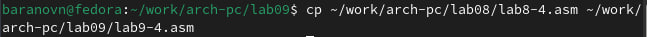{#fig:026 width=70%}

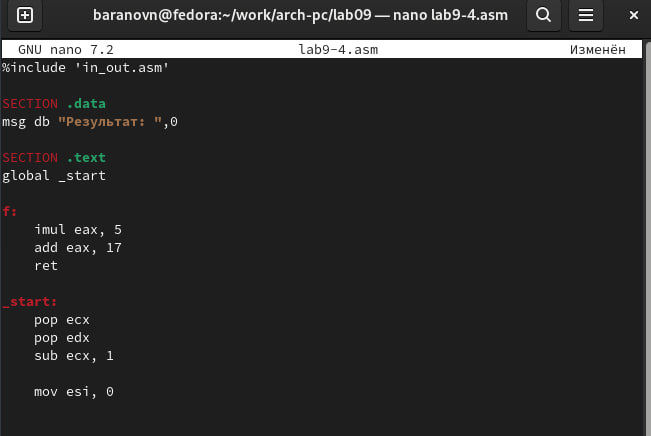{#fig:027 width=70%}

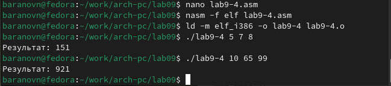{#fig:028 width=70%}

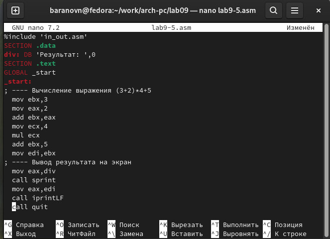{#fig:029 width=70%}

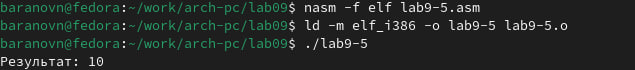{#fig:030 width=70%}

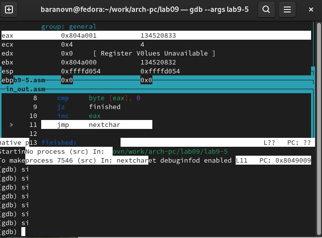{#fig:031 width=70%}

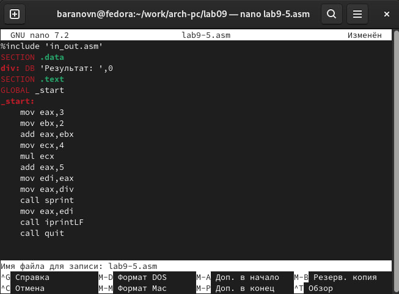{#fig:032 width=70%}

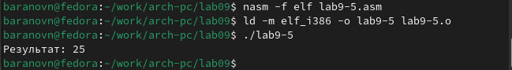{#fig:033 width=70%}

# Выводы

Мы познакомились с методами отладки при помощи GDB и его возможностями.

